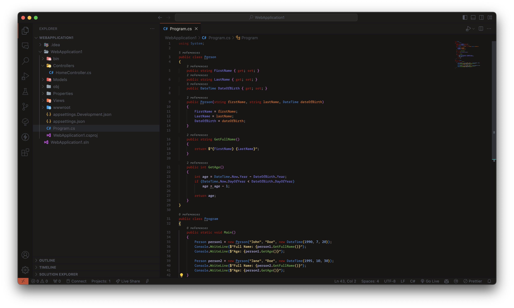
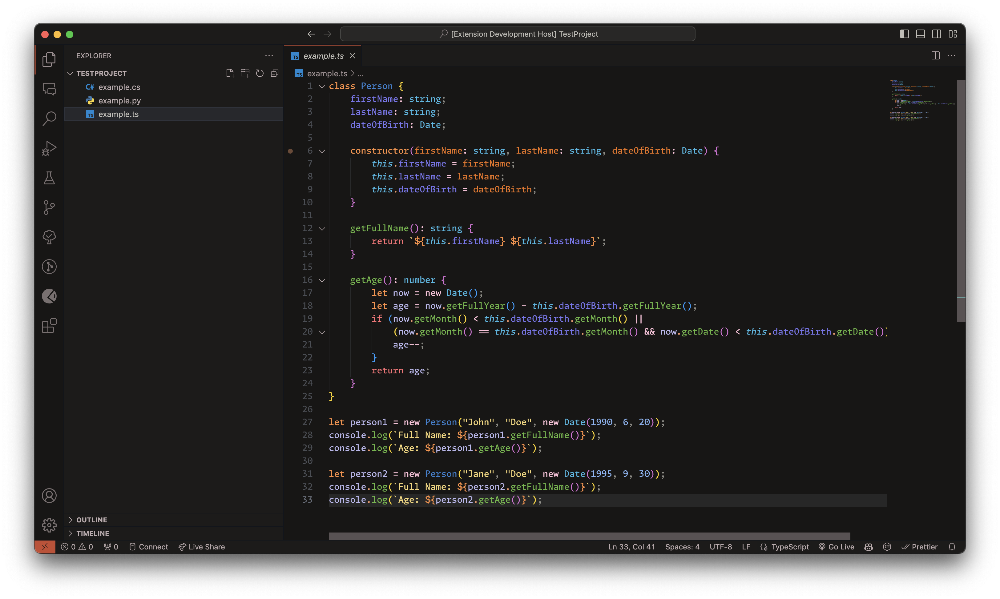
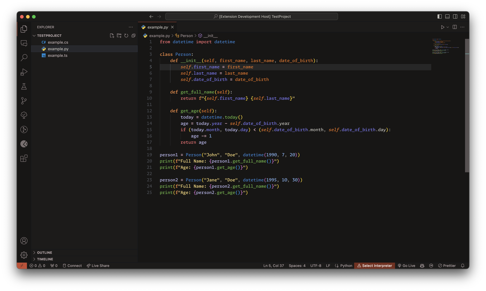

# Obsidian Sunset Theme

Obsidian Sunset is a dark and colorful theme for Visual Studio Code that enhances the readability and aesthetics of your code. 

The theme is inspired by the colors of the sky during sunset, with orange, yellow, purple, and blue hues. It features a deep black background with vibrant syntax highlighting in orange, green, blue, and grey. 

Whether you are coding in C#, Python, JS, or any other language, Obsidian Sunset will make your code stand out with its rich contrast and elegant design. 

Obsidian Sunset is ideal for developers who prefer a dark theme that is not too harsh on the eyes, but still provides a clear and pleasing visual experience.

# Screenshots

# Bugs & Suggestions
Should you encounter any bugs or have suggestions for improvement, we encourage you to open an issue on GitHub.

**Enjoy!**
